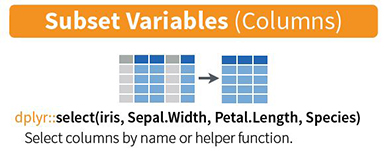
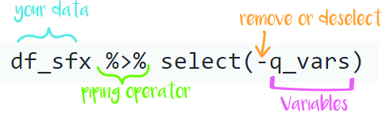
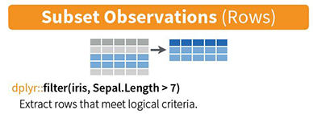
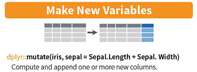
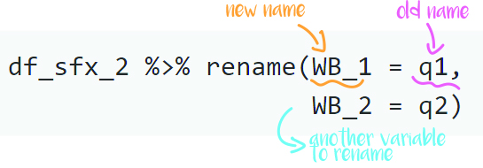
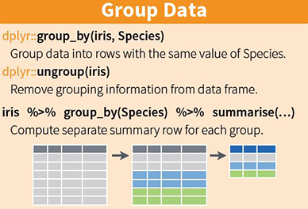
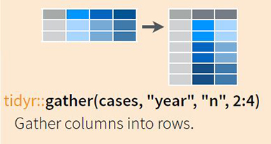
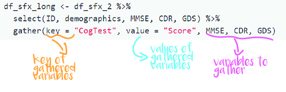

<!-- This file by Winson Yang is licensed under a Creative Commons Attribution 4.0 International License, adapted from the orignal work at https://github.com/rstudio/master-the-tidyverse by RStudio. -->

# R notebooks

This is an [R Markdown](http://rmarkdown.rstudio.com) Notebook. When you execute code within the notebook, the results appear beneath the code. 

R code goes in **code chunks**, denoted by three backticks. Executing code chunk by clicking the *Run* button within the chunk or by placing your cursor inside it and pressing *Crtl+Shift+Enter* (Windows) or *Cmd+Shift+Enter* (Mac). 


Along the workshop, I will try to share as many best practices as possible. These will be denoted by an fyi box like this:

:::fyi
This is a best practice in R coding (or at least i think it is)
:::

:::puzzle
This is an exercise for you to complete
:::

:::note
This is a is a hint for the exercise
:::


# Setup

The first chunk in an R Notebook is usually titled "setup," and by convention includes the R packages you want to load. Remember, in order to use an R package you have to run some `library()` code every session. Execute these lines of code to load the packages. 

To install a package, you have to type `install.packages("packagename")`. 

I've actually set the packages up in a way that if the package is not installeed yet `if(!require(packagename))` (`!require()` means package does not exist), it will automatically install it `install.packages("packagename")`, and run load the package `library(packagename)`.

Here is an example: `if (!require(knitr)) install.packages("knitr"); library(knitr)`.


```{r setup}

if (!require(knitr)) install.packages("knitr"); library(knitr)
knitr::opts_chunk$set(comment = "#", warning = FALSE, message = FALSE)

```

```{r load-package}

if (!require(kableExtra)) install.packages("kableExtra"); library(kableExtra)
if (!require(tidyverse)) install.packages("tidyverse") ; library(tidyverse)
if (!require(skimr)) install.packages("skimr") ; library(skimr)

```


# Loading data

First we have to know how to load our data. Without this step, there is no data to even begin manipulating!

With the `readr`, `haven`, `readxl` packages, we can load various type of data just by typing `read_*()`, where * could represent csv, txt, sav, sas, dta, or excel.

Here's an example:

```{r load-data}
# Set directories 
root_dir <- ".." # .. denotes the parent directory of 01-Data-Wrangling.Rmd
# You can set your root_dir to the directory of where RWorkshop is
# e.g. /User/YOURNAME/RWorkshop
data_dir <- file.path(root_dir, "data")

# Set files
sample_csvfile <- "sample_data1.csv"

# Load data
df_sfx <- read_csv(file.path(data_dir, sample_csvfile))
```

:::fyi
Notice that I separated and comment each part of the process to make it clear for the readers and I to follow. Also, I use `file.path()` to create several subfolders within the project directory (i call it root_dir). This type of naming will make things clear for more complex projects where you have several data sets in several folders, especially for longitudinal studies!

It is good to always create an Rproject for each project you are working on so R will automatically go to the directory where the RProject is located at when you open your project. Some common directories you may find are: data, output, R, plots, and report.
:::


##### Now, you try!

:::puzzle
Now let's try loading these few files into separate data frames:

1. load the sample_data.sav file with `read_spss()` and name it df_spss
2. load the spss_datadictionary.xlsx file with `read_excel()` and name it spss_datadict
:::

:::note
Hint 1: First, we have to load the `haven` and `readxl` packages as they are not loaded in the core tidyverse collection. Use the `library()` function to load these packages

Hint 2: use `file.path(filepath, filename)` to get the full path to a file rather than changing your directory! Do it like this:
:::

```{r load-data-exercise}
# Type your code after this line! 
library(haven)
library(readxl)
spss_file <- "sample_data3.sav"
spss_datadictfile <- "sample_data3_datadictionary.xlsx"

df_spss <- read_spss(file.path(data_dir, spss_file))
spss_datadict <- read_excel(file.path(data_dir, spss_datadictfile))
``` 


# Inspecting your data

The first thing we want to do is to inspect the data. We have two data sets and one data dictionary. Let's look at what each dataset contains. 


```{r inspect-data}
df_sfx
```

Did you notice how under every column or variable, the variable type is written there. For example, `Dx` is a `character`, and `Age` is a `double`. This format looks like a data frame, but it is in `tibble` format.

Tibbles are data frames, but they tweak some older behaviors to make life a little easier. I'll use the term data frame and tibble interchangeably here since we are working with data frames overall. 

The main difference between a tibble and a `data.frame` is the manner it is printed. Tibbles show only the first 10 rows, while `data.frame` shows everything! Hence, tibbles are designed so that you don't accidentally overwhelm your console when you print large data frames.

Try typing `df_sfx` and `as.data.frame(df_sfx)` in the console and see the difference.


#### Looking at summary statistics of the data.

With typing your variable name in the console or editor, you print out the data as you imported it. This step helps you look at whether you have imported your data correctly. 

The next thing you might want to do, is to examine some descriptives, such as the quartiles, min/max values, median, mean, and sd. We can do this by running `sumary()` or `skim()`.

```{r data-summary}
summary(df_sfx) # Gets the summary of each variable (Min/max values, quartiles, median, mean)
skim(df_sfx) # tells you similar things to summar(), but also gives you more! 
```
<br>
Did you see the difference between `summary()` and `skim()`? Skim also provides you with a small historgram at the last column, which is helpful if you want to know the distribution of the variable. Furthermore, it also highlights negative values in red!

:::fyi
`skim()` is one of the more powerful tools compared to `summary()` for basic data descriptives. I would recommend using it whenever you load a dataset to check whether your data has been loaded correctly.
:::


##### Now, you try! 

:::puzzle
First see what df_spss looks like, and then skim df_spss. What do you notice?
:::

```{r data-summary-exercise}
# Type your code after this line! 


```

Did you notice that there are some missing values *(NA)*? Most of our variables have this thing: `<S3: haven_labelled>`. This means that we also imported the labels from SPSS. These are in fact categorical variables rather than numerical variables. 

**This happens when you import SPSS files, so check them before you run further analysis!** This is the type of data spss gives you, as spss likes numbers. Hence, we use `skim()` to check our data first.

From skimming, we see 5 character columns and 2 numeric columns. We also know that agegp2, educ, EDUCGP2, DASSdepgp2, and EPDSgp2 are characters, and ID and age are numerics. 

So, how do we know what each number represents? We can see this by typing `df_spss$agegp2`. We use `$` after the data frame to call out the column of the data frame.

```{r spss-category-value}
df_spss$agegp2
```

##### Now, you try! 

:::puzzle
Look at the other variables: educ, EDUCGP2, DASSdepgp2, and EPDSgp2
:::

```{r spss-category-value-exercise}
# Type your code after this line! 


```

#### How do we convert these numerics into characters??

We can extract the labels from the dataset, but this takes a long time if we have a lot of variables. Hence, it is important to keep a data dictionary for our project. We have imported


#### Here's the Haven method.

We can apply `as_factor()` to the entire SPSS data to convert all the numerics with factor labels into characters. It will be easier for us in the future steps of the analysis.

```{r spss-asfactor}
df_spss_converted <- as_factor(df_spss)
df_spss
df_spss_converted
```


# Five commonly used functions for data manipulation

There are five key functions in tidyverse that allow you to solve the vast majority of your data-manipulation challenges. These functions specifically come from the **dplyr** package.

- Pick observations by their values `filter()`.
- Pick variables by their names `select()`.
- Reorder the rows `arrange()`.
- Create new variables with functions of existing variables `mutate()`.
- Collapse many values down to a single summary `summarize()`.


## Select

Sometimes we want to select certain variables to work with (your data may be huge). In that case, we can use `select()` to filter those variables out.



```{r fx-select}
df_sfx %>% select(ID)
```


We use `%>%` to "pipe" a value. The `%>%` comes from the `magrittr` package in `tidyverse`. This operator will forward a value, or the result of an expression, into the next function call/expression. In the above example, we take the `df_sfx` object, and forward it to the next step, which is to select the ID variable using `select(ID)`. 

Running analysis without `%>%` is like going to New York for a foodie hunt without trying New York's Pizza.

:::fyi
Use CTRL + SHIFT + M (WINDOWS) or CMD + SHIFT + M (MAC) to pipe!
:::

##### Now, you try! 

:::puzzle
Use the `%>%` function and `select()` to select these variables from `df_sfx`: Dx, Age, Sex
:::

:::note
Hint: Separate the variables in `select()` with a comma!
:::

```{r fx-select-exercise}
# Type your code after this line! 
df_sfx %>% select(Dx, Age, Sex)

```

Sometimes, you don't want some variables in your new data. For example, we do not want q1 to q6 in our new dataset. Hence we can use `select(-variable)` to subtract these variables from the data frame.




```{r fx-deselect}
df_sfx %>% select(-q1, -q2, -q3, -q4, -q5, -q6)

```

Okay let's look above: It is too long to type all the variables in the function to extract them out.
In this case we can use put these variables in vector format and parse them as an object for later use.

```{r fx-deselect2}
q_vars <- c("q1", "q2", "q3", "q4", "q5", "q6")
df_sfx %>% select(-q_vars)
```

See that `df_sfx %>% select(-q_vars)` gives you the same outcome as `df_sfx %>% select(-q1, -q2, -q3, -q4, -q5, -q6)`.

##### Now, you try! 

:::puzzle
We want to remove the DMN, SMN, SAN, and SN variables this time. They are seed-based functional connectivity networks in the brain. 
:::

:::note
Hint: Parse the variables you want to remove into an object called `FC_networks`.
:::

```{r fx-deselect-exercise}
# Type your code after this line! 
FC_networks <- c("DMN", "SMN", "SAN", "SN")
df_sfx %>% select(-FC_networks)

```


## Filter


We use `filter()` to remove or select rows depending on their values.




```{r fx-filter}
df_sfx %>% filter(Sex == "Female")
```

#### Comparisons and Logical Operators

**Comparisons:** We can use `>`, `>=`, `<`, `<=`, `!=` (not equal), and `==` (equal) to filter our values.
**Logical Operators:** We can also use `&` (and), `&&` (and something else) `|` (or) and `!` (not) to filter our variables too!


##### Now, you try!  

:::puzzle
Select and filter:

* All IDs, Age, Sex, Dx, MMSE, CDR, GDS, and Education of patients with MMSE > 23
* All IDs, Age, Sex, Dx, MMSE, CDR, GDS, and Education of patients with MMSE > 16 and CDR = 0
* All IDs, Age, Sex, Dx, MMSE, CDR, GDS, and Education of patients with MMSE > 16 & are either CONTROL, bvFTD, or nfvPPA
:::

:::fyi
Use SHIFT + ALT + UP/DOWN (windows) or COMMAND + OPTION + UP/DOWN (Mac) to copy a line above/below
:::

:::note
Hint: For no.2, you need to use two filter combinations: > , &
Hint: For no.3, you need to use three filter combinations: > , & , |
Hint: for characters such as CONTROL, you will need to use "CONTROL" instead of CONTROL
:::

```{r fx-filter-exercise}
# Type your code after this line! 
df_sfx %>% select(ID, Age, Sex, Dx, MMSE, CDR, GDS,  Education) %>% 
  filter(MMSE > 23)

df_sfx %>% select(ID, Age, Sex, Dx, MMSE, CDR, GDS,  Education) %>% 
  filter(MMSE > 16 & CDR == 0)

df_sfx %>% select(ID, Age, Sex, Dx, MMSE, CDR, GDS,  Education) %>% 
  filter(MMSE > 16 & c(Dx == "CONTROL" | Dx == "bvFTD"  | Dx == "nfvPPV"))


```

Typing `Dx == "CONTROL" | Dx == "bvFTD" | Dx == "nfvPPA"` takes a very long time. What if you have 10 categorical variables (we have 6 here), and you want 7 of them? It is not the best practice to use this method.

What we can do, is to use `%in%` to retrieve the categories that we want


For example, if we want to extract these patient groups: CONTROL, PSP, svPPA, we can do this:

```{r fx-filter2}
myDx <- c("CONTROL", "PSP", "svPPA")
df_sfx$Dx %in% myDx
```

This returns a vector of TRUE and FALSE on which row has either CONTROL, PSP, or svPPA.

Hence we can use this to filter the rows!


```{r create-demographics}
demographics <- c("Dx", "Age", "Sex", "Education")


df_sfx %>% select(all_of(demographics), MMSE) %>% filter(MMSE > 23 & Dx %in% myDx)
```

##### Now, you try!  

:::puzzle
Use the `%in%` method to get:

* All IDs, Age, Sex, Dx, MMSE, CDR, GDS, and education of patients with MMSE > 16 & are either CONTROL, bvFTD, or nfvPPA
:::

```{r fx-filter2-exercise}
# Type your code after this line! 
demographics <- c("ID", "Age", "Sex", "Dx", "MMSE", "CDR", "GDS", "Education")
myDx <- c("CONTROL", "bvFTD", "nfvPPA")
df_sfx %>% select(demographics) %>% filter(Dx %in% myDx)

```


## Arrange

`arrange()` works similarly to `filter()` except that instead of selecting rows, it changes their order. It takes a data frame and a set of column names (or more complicated expressions) to order by.


```{r fx-arrange}
df_sfx %>% arrange(Sex, MMSE)
```


##### Now, you try!  

:::puzzle
Arrange df_sfx by diagnosis, followed by their MMSE
:::

```{r fx-arrange-exercise}
# Type your code after this line! 
df_sfx %>% arrange(Dx, MMSE)

```


### desc

We can also use desc() to reorder by a column in descending order:

```{r fx-arrange-desc}
df_sfx %>% arrange(desc(Dx), MMSE)

```

##### Now, you try!  

:::puzzle
Use `desc()` to arrange the GDS in descending order.
:::

```{r fx-arrange-desc-exercise}
# Type your code after this line! 
df_sfx %>% arrange(desc(GDS))

```


## Mutate


Sometimes we have questionnaire items and we may want to compute the total score. It is useful to add new columns that are functions of existing columns. That's the job of `mutate()`.

`mutate()` always adds new columns at the end of your dataset so we'll start by creating a narrower dataset so we can see the new variables.




```{r fx-mutate}
df_sfx %>% select(demographics, q1:q6) %>% mutate(q_total = q1 + q2 + q3 + q4 + q5 + q6)
```

What if you have 20 items in your questionnaires that you have to sum? Yes, there is a more efficient way to do this. We can use the combination of `rowSums()` and `select()`.


```{r fx-mutate2}
q_items <- c("q1", "q2", "q3", "q4", "q5", "q6")
df_sfx %>% select(demographics, q1:q6) %>% mutate(q_total = rowSums(.[q_items]))

```


##### Now, you try!  

:::puzzle
For our questionnaire items, we want to reverse q2, q4, and q6. Here are some description:
Minimum score: 1
Maximum score: 5

1. Create reversed scores for q2, q4, and q6 in a new data frame called `df_sfx_2`
2. Sum the new questionnaire items with the new data frame
:::

:::note
Hint: Use MaxScore + MinScore - score to reverse
:::

```{r fx-mutate-exercise}
# Type your code after this line! 
MaxScore <- 5
MixScore <- 1
q_new_items <- c("q1", "q2_r", "q3", "q4_r", "q5", "q6_r")
df_sfx %>% mutate(q2_r = MaxScore + MixScore - q2,
                  q4_r = MaxScore + MixScore - q4,
                  q6_r = MaxScore + MixScore - q6,
                  ) %>% 
  mutate(q_total = rowSums(.[q_new_items]))

```

Using mutate multiple times can waste time if you have many items to reverse. There is another method you can use to mutate over mutliple variables. Here is an example:

```{r fx-mutate-simplify}

# First create a function to reverse score
reverseScore <- function(item, MaxScore, MinScore) {
  # if max is 5 and mix is 1, reversed scores should be 5, 4, 3, 2, 1
  # 5+1 - 1 = 5, 5+1 - 2 = 4, 5+1 - 3 = 3, 5+1 - 2 = 4, 5+1 - 1 = 5
  MaxScore + MinScore - item
}


# Then we create the new variables in the data frame
MaxScore <- 5; MinScore <- 1
df_sfx_2 <- df_sfx %>% select(demographics, q1:q6) %>% 
  mutate_at(vars("q2", "q4", "q6"), 
            list(r = ~reverseScore(., MaxScore, MinScore))) # append _r at the end of the variable

# Compute the total score
new_q_items <- c("q1", "q2_r", "q3", "q4_r", "q5", "q6_r")
df_sfx_2 %>% mutate(q_total = rowSums(.[new_q_items]))

```


Here's another method:

```{r fx-mutate-simplify2}
toReverse <- c("q2", "q4", "q6")
Reverse_newName <- c("q2_r", "q4_r", "q6_r")

# Simple loop to create new variables
df_sfx_2 <- df_sfx
MaxScore <- 5; MinScore <- 1
for (i in 1:length(toReverse)) {
  df_sfx_2[Reverse_newName[i]] <- reverseScore(df_sfx[, toReverse[i]], MaxScore, MinScore)
}

df_sfx_2 %>% mutate(q_total = rowSums(.[new_q_items]))

```

### Renaming Variables

q1 to q6 doesn't really mean anything to us at this point, as they are random variables I create just for this workshop. 

Let's assume q1 to q6 represents some well-being scale, with higher scores indicating better well-being. The minimum score patients can achieve on this scale is 6, and the maximum score they can achieve is 30.

So let's rename q1 to q6 into WB_1 to WB_6 using `rename()` so we know what questionnaire it is.


I will show you an example on one item:

```{r fx-rename}
df_sfx_2 %>% rename(WB_1 = q1, 
                    WB_2 = q2)

```



##### Now, you try!  

:::puzzle
Rename q1 to q6 into WB_1 to WB_6, including the reversed items (q2_r, q4_r, q6_r). Remember, we have not created a variable for the total score yet.
:::


```{r fx-rename-exercise}
# Type your code after this line! 
df_sfx_2 %>% rename(WB_1 = q1, 
                    WB_2 = q2,
                    WB_3 = q3, 
                    WB_4 = q4,
                    WB_5 = q5, 
                    WB_6 = q6,
                    WB_2_r = q2_r, 
                    WB_4_r = q4_r,
                    WB_6_r = q6_r,
                   
                    )

```

We can also use `%in%`to rename these variables

```{r fx-rename-in}
# Simple loop to create new variables
oldnames <- c("q1", "q2", "q3", "q4", "q5", "q6", "q2_r", "q4_r","q6_r")
newnames <- c("WB_1", "WB_2", "WB_3", "WB_4", "WB_5", "WB_6", "WB_2_r", "WB_4_r","WB_6_r")
names(df_sfx_2)[names(df_sfx_2) %in% oldnames] <- newnames
```


### Splitting continuous variables to categorical variables

Sometimes you may want to split your variables into categorical (e.g. high, medium, low) to run some interaction effects. In this case, we can use `cut()` along with `mutate()` to create a new variable, and convert it from continuous to categorical.

```{r fx-mutate-category}
df_sfx_2 %>% mutate(category = cut(MMSE, 
                                   breaks = c(0, 15, 23, 30),
                                   labels = c("Severe","Moderate","Functioning"))) %>% 
  select(MMSE, category) %>% arrange(MMSE)
```

The above code creates 3 categories: Severe MMSE (0-15), Moderate MMSE (16-23), and Functioning MMSE (24-30). For **n** categories, you will need **n + 1** breaks as the scores in between the breaks are used to form the categories.

Hence if you want to create High vs Low MMSE, then you will need 3 break values:

```{r fx-mutate-category2}
df_sfx_2 %>% mutate(category = cut(MMSE, 
                                   breaks = c(0, 15, 30),
                                   labels = c("Low","High")))
```


##### Now you try

:::puzzle
Create a new variable called education_cat that contains education level in categories.

- less than high school (< 12 years)
- high school (12 - 15 years)
- college graduation (16 - 19 years)
- advanced graduate degree (=> 20 years)
:::

```{r fx-mutate-category-exercise}
# Type your code after this line! 
df_sfx_2 %>% mutate(education_cat = cut(Education, 
                                        breaks = c(0, 11, 15, 19, 99),
                                        labels = c("less than high school",
                                                   "high school",
                                                   "college graduation",
                                                   "advanced graduate degree")))

```


### Let's try some exercises from scratch!


These are the steps you will need to perform to get to the final data.

1. Create an object called `df_sfx_3` with ages above 65, MMSE > 16, CDR < 1, education = 17 (use `filter()`)

2. Then, create the total score for WB (use `mutate()`)

3. Select these variables: SAN, DMN, SN, Age, MMSE, Dx, CDR, TASIT, WB total score (use `select()`)

4. Arrage the data by CDR, with ascending order (use `arrange()`).

print or skim the data (type df_sfx_3)

:::note
Hint: Use the magrittr pipe `%>%` to continue your code from the previous step
:::

```{r exercise1}
# Type your code after this line! 
WB_items <- c( "WB_1", "WB_3", "WB_5", "WB_2_r", "WB_4_r", "WB_6_r")
df_sfx_3 <- df_sfx %>% filter(Age > 65, MMSE > 16, CDR < 1, Education == 17) %>% 
  mutate_at(vars("q2", "q4", "q6"), 
            list(r = ~reverseScore(., MaxScore, MinScore))) %>% 
  rename(WB_1 = q1, WB_2 = q2, WB_3 = q3, 
         WB_4 = q4, WB_5 = q5, WB_6 = q6,
         WB_2_r = q2_r, WB_4_r = q4_r, WB_6_r = q6_r) %>% 
  mutate(WB_total = rowSums(.[WB_items])) %>% 
  select(SAN, DMN, SN, Age, MMSE, Dx, CDR, TASIT, WB_total) %>% 
  arrange(CDR)
df_sfx_3
skim(df_sfx_3)

```


## Grouping variables and summarizing data

Two functions that are usually used together are `group_by()` and `summarize()`. You don't really use `group_by()` alone, as there is no reason to group data unless you want to create a summary such as mean, sd, or median.





```{r fx-groupby-summarize}
df_sfx_2 %>% group_by(Dx) %>% summarize(CDR_mean = mean(CDR),
                                           CDR_SD = sd(CDR))
```

What do you notice about the CDR for the CONTROLS? Which group has the highest CDR?


##### Now, you try!  

:::puzzle
Use `group_by()`, `summarise()` to summarize the mean, sd, and median of MMSE in each diagnostic group. Use df_sfx_2 for this exercise.
:::

:::note
Hint: mean: `mean()`, sd: `sd()`, median: `median()`.
:::

```{r fx-groupby-summarize-exercise}
# Type your code after this line! 
df_sfx_2 %>% group_by(Dx) %>% 
  summarize(MMSEmean = mean(MMSE),
            MMSESD = sd(MMSE),
            MMSEmedian = median(MMSE)) 
```


# Now, let's put everything together!

Use `group_by()`, `summarise()`, and `arrange()` to display each Dx group's GDS, MMSE, and CDR mean score in descending order **(Highest GDS on top)**. Call this data frame `df_sfx_groupsummary`. Use df_sfx_2 for this exercise.

```{r exercise2}
# Type your code after this line! 
df_sfx_groupsummary <- df_sfx_2 %>% group_by(Dx) %>% 
  summarize(GDSmean = mean(GDS),
            MMSEmean = mean(MMSE),
            CDRmean = mean(CDR)) %>% arrange(desc(GDSmean))
df_sfx_groupsummary
```


# Turning wide to long data format and vice versa

Frequently data will be in formats that are unsuitable for analysis. One of the most common examples of this issue encountered is data where things that should be in the rows are in the columns or vice versa. In these cases, we need to rearrange the data we've received into a form that is easier to deal with. 

When we want to turn wide data format into long data format, we can use `gather()`.

`data %>% gather(key = "NewVariableName", value = "NewResult")` is the typical structure of using this code, but it can get complicated with keys and values.




In short:

* `key`: the name of the column that will consist of the variables you want in long format
* `value`: the values of the columns that you want in long format.



Here's an example:

```{r fx-gather}
df_sfx_2 %>% select(ID, demographics, MMSE, CDR, GDS) %>% # Select only relevent variables to keep columns short
  gather(key = "CogTest", value = "Score", MMSE, CDR, GDS) %>% 
  arrange(ID)
```


Did you see that the variables MMSE, CDR, and GDS has now disappeared? It is now contained in a new variable called CogTest. Furthermore, we now have 600 rows instead of 200! This is because we have 200 patients and 3 tests that have to be rearranged into long format.

The opposite of `gather()` is `spread()`. As you might have guessed, it turns long data into wide data format.


Here's an example:

```{r fx-gather-spread}
# Set an example long data from previous line
df_sfx_long <- df_sfx_2 %>% 
  select(ID, demographics, MMSE, CDR, GDS) %>% 
  gather(key = "CogTest", value = "Score", MMSE, CDR, GDS)

# Now turn the long data back to wide data
df_sfx_long %>% spread(key = "CogTest", value = "Score") # Note that it spreads by alphabetical order unless you specify otherwise.

```


The format is similar to `gather()`:

* `key`: The column you want to split (should be categorical)
* `value`: The column you want to use to populate the new columns (the `value` column we just created in the spread step)


##### Now, you try!

:::puzzle
Using the `df_sfx_groupsummary` we have just created, gather the MMSE, CDR, and GDS into one column called `CogTest`.
:::

```{r fx-gather-exericse}
# Type your code after this line!
df_sfx_groupsummary %>% gather(key = "CogTest", value = "Score",
                               MMSEmean, CDRmean, GDSmean)
```


# Example of running statistical analysis using Tidyverse

The functions above are preparation steps to get your data ready to run statistical analyses. Once these are completed, you can begin to run your data analysis using the tidyverse format!

For example, you might be interested in:   

1. diagnostic groups: CONTROLS, bvFTD, svPPA 

2. MMSE > 16  

3. CDR < 1 (early stage of disease)


The variables you might want to analyze are TASIT (emotion reading), DMN, SAN, SN (these are brain networks), and WB (questionnaire).

Your analysis plan might look like this:

## Getting the data ready

```{r stats-setdata}
# Set interested variables
demo <- c("ID", "Age", "Sex", "Dx", "Education", "CDR", "MMSE")
myDx <- c("CONTROLS", "bvFTD", "svPPA")
FCs <- c("SAN", "SN")
WBs_old <- c("q1", "q2", "q3", "q4", "q5", "q6")
WBs_new <- c("q1", "q2_r", "q3", "q4_r", "q5", "q6_r")
EmoTest <- c("TASIT")

# Reverse scoring function and prep
reverseScore <- function(item, MaxScore, MinScore) {
  # if max is 5 and mix is 1, reversed scores should be 5, 4, 3, 2, 1
  # 5+1 - 1 = 5, 5+1 - 2 = 4, 5+1 - 3 = 3, 5+1 - 2 = 4, 5+1 - 1 = 5
  MaxScore + MinScore - item
}
MaxScore <- 5; MinScore <- 1

# Subset data
df <- df_sfx %>% # Take the data
  select(all_of(demo), 
         all_of(FCs), 
         all_of(WBs_old), 
         all_of(EmoTest)) %>% # Select interested vars
  filter(Dx %in% myDx) %>% # Filter only myDx
  mutate_at(vars("q2", "q4", "q6"), 
            list(r = ~reverseScore(., MaxScore, MinScore))) %>% # append _r at the end of the variable 
  mutate(WB_Score = rowSums(.[WBs_new])) %>%  # Create WB total score
  select(all_of(demo), 
         all_of(FCs), 
         WB_Score,
         all_of(EmoTest))

skim(df)

```

## Run some statistical analyses

Let's say you want to examine: 

1. the differences in MMSE between the patient groups (ANOVA)

2. the relationship between SAN and TASIT, controlling for MMSE, Education, Age, and Sex (linear regression)


### 1. ANOVA: Differences in MMSE between the patient groups

```{r stats-anova}
mod1 <- aov(MMSE ~ Dx, data = df)
mod1 %>% broom::tidy()# or mod1 %>% summary()
summary(mod1)

```


### 2. Regression: Relationship between SAN and TASIT, controlling for MMSE, Education, Age, and Sex

#### Covariates model

```{r stats-regression-cov}
reg_cov <- lm(TASIT ~ MMSE + Education + Age + Sex, data = df)
reg_cov %>% summary()

```

#### Full model

```{r stats-regression-mod}
reg_mod <- lm(TASIT ~ MMSE + Education + Age + Sex + SAN, data = df)
reg_mod %>% summary()
```

#### Model change comparison

```{r stats-regression-compare}
stats::anova(reg_cov, reg_mod)
stats::anova(reg_cov, reg_mod) %>% broom::tidy()

```


:::fyi
Use `tidy()` from the `broom` package to summarize information about the components of a model
:::


# Take aways

* Extract variables with `select()`  
* Extract cases with `filter()`  
* Arrange cases, with `arrange()`  

* Connect operations with `%>%`  

* Make tables of summaries with `summarise()`  
* Make new variables with `mutate()`  
* Do groupwise operations with `group_by()`

* turn data into long format using `gather()`, and into wide format using `spread()`.

