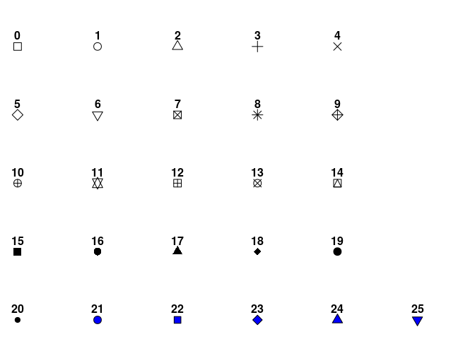
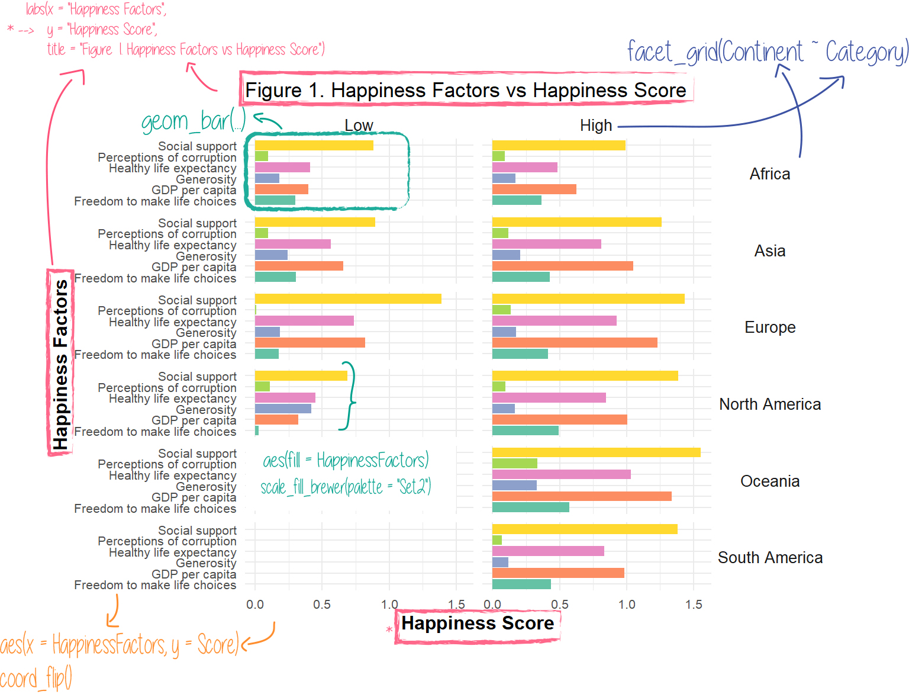
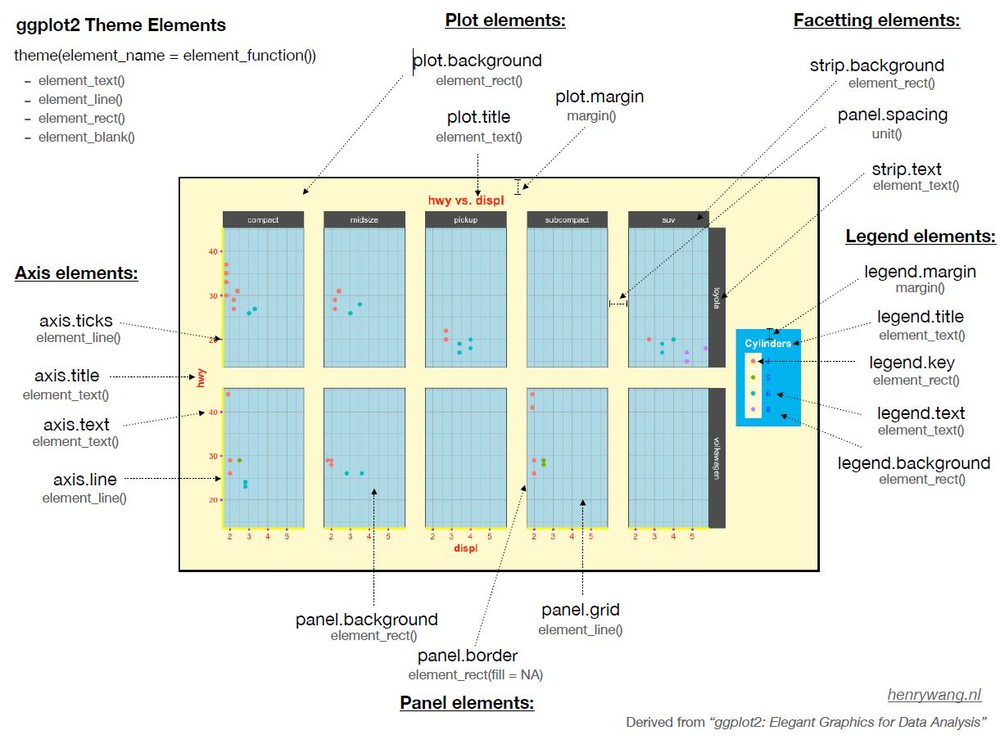

<!-- This file by Winson Yang is licensed under a Creative Commons Attribution 4.0 International License, adapted from the orignal work at https://github.com/rstudio/master-the-tidyverse by RStudio. -->

# R notebooks

This is an [R Markdown](http://rmarkdown.rstudio.com) Notebook. When you execute code within the notebook, the results appear beneath the code. 

R code goes in **code chunks**, denoted by three backticks. Executing code chunk by clicking the *Run* button within the chunk or by placing your cursor inside it and pressing *Crtl+Shift+Enter* (Windows) or *Cmd+Shift+Enter* (Mac). 


Along the workshop, I will try to share as many best practices as possible. These will be denoted by an fyi box like this:

:::fyi
This is a best practice in R coding (or at least i think it is)
:::

:::puzzle
This is an exercise for you to complete
:::

:::note
This is a is a hint for the exercise
:::


# Setup

The first chunk in an R Notebook is usually titled "setup," and by convention includes the R packages you want to load. Remember, in order to use an R package you have to run some `library()` code every session. Execute these lines of code to load the packages. 

To install a package, you have to type `install.packages("packagename")`. 

I've actually set the packages up in a way that if the package is not installeed yet `if(!require(packagename))` (`!require()` means package does not exist), it will automatically install it `install.packages("packagename")`, and run load the package `library(packagename)`.

Here is an example: `if (!require(knitr)) install.packages("knitr"); library(knitr)`.


```{r setup}
if (!require(knitr)) install.packages("knitr"); library(knitr)
knitr::opts_chunk$set(comment = "#", warning = FALSE, message = FALSE)
```

```{r warning = FALSE, message = FALSE}
if (!require(kableExtra)) install.packages("kableExtra"); library(kableExtra)
if (!require(tidyverse)) install.packages("tidyverse") ; library(tidyverse)
if (!require(ggrepel)) install.packages("ggrepel") ; library(ggrepel)
if (!require(skimr)) install.packages("skimr") ; library(skimr)
```


### Load your data

We are going to load the `sample_data1.csv` dataset located in the datadir. Let's load the data first.

```{r load-data}
# Set directories 
root_dir <- "../"
data_dir <- file.path(root_dir, "data")

# Set files
sample_csvfile <- "sample_data2.csv"

# Load data
df <- read_csv(file.path(data_dir, sample_csvfile))
```

Let's get a rough idea of how our data looks like using R. Use `skim()` to see our data

```{r load-data-exercise}
# Type in your code after this line!


```

# What is ggplot?


GGplot is a powerful data visualization package in R! 

Advantages of ggplot2

* consistent underlying grammar of graphics by Wilkinson (2005)
* plot specification at a high level of abstraction
* very flexible
* theme system for polishing plot appearance
* mature and complete graphics system
* many users, active mailing list


## Grammar of ggplot

Understanding the grammar of ggplot2  is fundamental to being able to use it effectively. There are many layers of plotting with ggplot. Ggplot uses independent building blocks and combine them to create just about any kind of graphical display you want. These layers include:

* data
* aesthetic mapping
* geometric object
* faceting
* statistical transformations
* coordinate system
* themes

{width=450px}


# Plotting the data

The first thing in ggplot is reference a data to plot. You can do this by using the pipe, or typing it in the code itself.

`df %>% ggplot()` is the same as `ggplot(data = df)`

```{r ggplot-canvas}
df %>% ggplot()

```

##### Now, you try!

:::puzzle
Use `ggplot(data = df)` to see how the plot looks like.
:::


```{r ggplot-canvas-exercise}
# Type your code below this line!


```

The results are the same! 

`ggplot(data = df)` puts the ggplot graphing canvas out and loads the data onto ggplot, so you won't have to call the variable from the data every time.


## Adding aesthetics

In ggplot, aesthetics are something you can see. They include:

* position (i.e., on the x and y axes)
* color ("outside" color)
* fill ("inside" color)
* shape (of points)
* linetype
* size


Each type of geom accepts only a subset of all aesthetics-refer to the geom help pages to see what mappings each geom accepts. Aesthetic mappings are set with the `aes()` function.

```{r ggplot-aes}
df %>% ggplot(aes(x = Generosity, # Set the X variable
                  y = Score # Set the Y variable
                    ))
```


Notice that now you can see the X and Y axes. However, did you notice that the data points are missing? It is because these points are geometric objects, or `geoms`.

##### Now, you try!

:::puzzle
Set the X axis to GDP per capita and y axis to Healthy life expectancy.
:::puzzle

:::note
*Hint: use ``` `Variable Name` ``` when there are spaces in your variable names.
:::

```{r ggplot-aes-exercise}
# Type your code below this line!


```


## Adding geometrics


Geometric objects are the actual marks we put on a plot. Examples include:

* points (`geom_point`, for scatter plots, dot plots, etc)
* lines (`geom_line`, for time series, trend lines, etc)
* boxplot (`geom_boxplot`, for, well, boxplots!)

A plot must have at least one geom; there is no upper limit. You can add a geom to a plot using the + operator

ggplot provides a number of geoms:

``` {r eval = FALSE}
geom_abline      geom_density_2d  geom_linerange   geom_rug
geom_area        geom_density2d   geom_map         geom_segment
geom_bar         geom_dotplot     geom_path        geom_sf
geom_bin2d       geom_errorbar    geom_point       geom_sf_label
geom_blank       geom_errorbarh   geom_pointrange  geom_sf_text
geom_boxplot     geom_freqpoly    geom_polygon     geom_smooth
geom_col         geom_hex         geom_qq          geom_spoke
geom_contour     geom_histogram   geom_qq_line     geom_step
geom_count       geom_hline       geom_quantile    geom_text
geom_crossbar    geom_jitter      geom_raster      geom_tile
geom_curve       geom_label       geom_rect        geom_violin
geom_density     geom_line        geom_ribbon      geom_vline
```

Below are examples of the geoms:


More information about ggplot can be found in the [ggplot page](https://ggplot2.tidyverse.org/reference/index.html)

Additional geoms are available in packages like [`ggbeewsarm`](https://github.com/eclarke/ggbeeswarm) and [`ggridges`](https://github.com/wilkelab/ggridges)


```{r ggplot-geom_point}
df %>% ggplot(aes(x = Generosity, # Set the X variable
                  y = Score # Set the Y variable
                    )) +
  geom_point()
```

Now we get to see the data points in the plot!


##### Now, you try!

:::puzzle
Add the points for your GDP v healthy life expectancy plot
:::

```{r ggplot-geom_point-exercise}
# Type your code below this line!


```


Now, you have just successfully created your first plot using ggplot. Great job!

Let's make it more neat by adding a line using `geom_smooth()`.


```{r ggplot-geom_smooth}
df %>% ggplot(aes(x = Generosity, # Set the X variable
                  y = Score # Set the Y variable
                    )) +
  geom_point() +
  geom_smooth()
```

Now, we normally want to see a linear trend, so we have to adjust the line to make it linear. We can do this by setting the properties of `geom_smooth()` to `geom_smooth(method = "lm")`. 

:::fyi
**It is good to check the documentation of ggplot and its functions to learn more.**
:::fyi

```{r ggplot-geom_smooth-lm}
df %>% ggplot(aes(x = Generosity, # Set the X variable
                  y = Score # Set the Y variable
                    )) +
  geom_point() +
  geom_smooth(method = "lm")
```

##### Now, you try!

:::puzzle
Add the regression line to your GDP v healthy life expectancy plot In addition, remove the confidence interval.
:::

:::note
Hint: Check `se` in the documentation.
:::

```{r ggplot-geom_smooth-exercise}
# Type your code below this line!


```


## Adding regression model into plot

Sometimes you might want to add your regression model into the plot. You can do this in ggplot too!

```{r ggplot-geom_smooth-regression}
reg_model <- lm(Score ~ Continent + `Social support` + Generosity , data = df) # Fit your regression model

predicted_df <- data.frame(predicted_vals = predict(reg_model, df), 
                           Generosity = df$Generosity)

df %>% ggplot(aes(x = Generosity, # Set the X variable
                  y = Score # Set the Y variable
                  )) +
  geom_point() +
  geom_smooth(data = predicted_df,
              aes(x = Generosity, 
                  y = predicted_vals),
              method = "lm", color = "red")
```


### Bar plot

:::puzzle
I want you to try this first. Create a bar plot for Continent vs Score. Use `geom_bar(position = "dodge", stat = "identity")` to add it to ggplot.
:::


```{r ggplot-geom_bar}
# Type your code below this line!


```

:::puzzle
Keep this plot in mind! Now, create mean Score for each Continent. 
:::

:::note
Hint: You need to use `group_by() %>% summarize()` to create the mean score.
:::

```{r ggplot-geom_bar-exercise}
# Type your code below this line!


```

Do you notice the difference between the scores on the plot and the mean scores? They are different!

This is one problem with ggplot when you want to plot bar charts.

:::fyi
It is advisable to summarize the data using `group_by` and `summarize` first before plotting if you are doing group plots.
:::


Now, create a mean score data called `ContinentScore` and plot it.

```{r ggplot-geom_bar-exercise2}
# Type your code below this line!


```


Now this is the correct bar graph!


## Various types of box plots

There are various types of box plots, including the standard box plots, violin plots, and jittered dot plots (`beeswarm` package).

Let's explore these plots!


For box plot:


```{r ggplot-geom_boxplot}
df %>% 
  ggplot(aes(x = Continent, y = `GDP per capita`)) +
  geom_boxplot() +
  geom_point()
```

With box plots, you cannot see the distribution, even when you add the points on top of the box plots.

Let's try to jitter the points using `geom_jitter()`.


```{r ggplot-geom_jitter}
df %>% 
  ggplot(aes(x = Continent, y = `GDP per capita`)) +
  geom_boxplot() +
  geom_jitter()
```


You still don't really see the sample distribution with this.

Hence we can use violin plots to see the means and distribution at the same time.


For violin plot:

```{r ggplot-geom_violin}
df %>% 
  ggplot(aes(x = Continent, y = `GDP per capita`)) +
  geom_violin()

```


For a nice dotted box plot, you can use the [`beeswarm`](https://github.com/eclarke/ggbeeswarm) package.

```{r ggplot-beeswarm}
if (!require(ggbeeswarm)) install.packages("ggbeeswarm"); library(ggbeeswarm)

df %>% 
  ggplot(aes(x = Continent, y = `GDP per capita`)) +
  geom_quasirandom()

```


The shape looks a lot like the violin plot! Let's stack the geoms to see how it looks!

```{r ggplot-beeswarm2}
df %>% 
  ggplot(aes(x = Continent, y = `GDP per capita`)) +
  geom_violin() +
  geom_quasirandom()

```

Note that the order of aesthetics and geometrics affect the layout of your plot!
 
```{r ggplot-ordermatters}
df %>% 
  ggplot(aes(x = Continent, y = `GDP per capita`)) +
  geom_quasirandom()  +
  geom_violin()

```


# Adding layers to your data

Now we only have a basic plot. What if you want to look at where the groups are in the dimensional space? We can add more aesthetics! 


## Adding color

We can add color to different categories in the plot inside the aesthetics.

``` {r ggplot-color}
df %>% ggplot(aes(x = Generosity, # Set the X variable
                  y = Score # Set the Y variable
                    )) +
  geom_point(aes(color = Continent)) +
  geom_smooth(method = "lm")

```

If we want the overall of the points to change, set the color outside aesthetics.

``` {r ggplot-color2}
df %>% ggplot(aes(x = Generosity, # Set the X variable
                  y = Score # Set the Y variable
                    )) +
  geom_point(color = "Red") + # You can only set Continent to colors inside aesthetics
  geom_smooth(method = "lm")

```

##### Now, you try!

:::puzzle
Set the points to colors of different amounts of social support to your GDP v healthy life expectancy plot.
:::

``` {r ggplot-color-exercise}
# Type your code after this line!


```


## Changing the size of the points

Now the points look a little small to the eyes. We can increase the size using `geom_*point*(size = N)` where N is the size in integer.

``` {r ggplot-size}
df %>% ggplot(aes(x = Generosity, # Set the X variable
                  y = Score # Set the Y variable
                    )) +
  geom_point(aes(color = Continent),
             size = 6) + # You can only set Continent to colors inside aesthetics
  geom_smooth(method = "lm", 
              size = 3, 
              color = "black")

```


##### Now, you try!

:::puzzle
Try to play around with the size of the grouped bar plot. 

1. Add colors to Continent.
2. Change the size of the bars. Instead of `size`, use `width`.
:::


```{r ggplot-size-exercise}
# Type your code after this line!


```

With bar charts, you have to use `fill` to fill the bars. Remember that colors are for the outside colors (borders) and fill are for the inside colors.


```{r ggplot-fill}
df %>% group_by(Continent) %>% summarize(GDP = mean(`GDP per capita`)) %>%
  ggplot(aes(x = Continent, y = GDP)) +
  geom_bar(aes(fill = Continent), 
           color = "black",
           stat = "identity",
           width = 0.3)

```


When you use size in `geom_bar`, you are changing the size of the border.


```{r ggplot-fill-bar}
df %>% group_by(Continent) %>% summarize(GDP = mean(`GDP per capita`)) %>%
  ggplot(aes(x = Continent, y = GDP)) +
  geom_bar(aes(fill = Continent), 
           color = "black",
           stat = "identity",
           size = 5,
           width = 0.3)

```


## Changing shapes


Changing the shapes of the points can be a good way to identify different groups. There are many shapes in ggplot, which can be identified by `shape` or `pch` if used in aesthetics.



```{r ggplot-shape}
df %>% ggplot(aes(x = Generosity, # Set the X variable
                  y = Score # Set the Y variable
                    )) +
  geom_point(aes(color = Continent),
             size = 6,
             shape = 23) + # See how the coloring has changed!
  geom_smooth(method = "lm", 
              size = 3, 
              color = "black")


```

Now the points has changed from circles to diamonds. But only the outside color remains, while the inner color is gone. Can you guess why?


##### Now, you try!

:::puzzle
With GDP vs Healthy life expectancy, add different shapes to continents, and **retain the colors of each Continent**.  
:::

:::note
Hint: Remember that ordering matters
:::

```{r ggplot-shape-exercise}
# Type your code after this line!


```


## Adding text!

Sometimes you want to add text to your data! Well, ggplot can do it too, using `geom_text` or `geom_text_repel`.


```{r ggplot-text}
if (!require(ggrepel)) install.packages("ggrepel") ; library(ggrepel)

pointsToLabel <- c("Russia", "Venezuela", "Iraq", "Myanmar", "Sudan",
                   "Afghanistan", "Congo", "Greece", "Argentina", "Brazil",
                   "India", "Italy", "China", "South Africa", "Ukraine",
                   "Botswana", "Costa Rica", "Bhutan", "Rwanda", "France",
                   "United States", "Germany", "United Kingdom", "Barbados", "Norway", "Japan",
                   "New Zealand", "Singapore")

df %>% ggplot(aes(x = Generosity, # Set the X variable
                  y = Score # Set the Y variable
                    )) +
  geom_point(aes(fill = Continent), # I used fil because i set the shape to transparent circle
             shape = 21, # Shape set to transparent circle
             size = 6) + 
  geom_smooth(method = "lm", 
              size = 1) +
  geom_text_repel(aes(label = `Country or region`),
                  color = "gray20",
                  data = filter(df, `Country or region` %in% pointsToLabel),
                  force = 10)

```

# Faceting your plot

When you want to plot in separate groups, you can use facets. Facetting facilitates comparison among plots, not just of geoms within a plot. `ggplot2` offers two functions for creating smaller graphs:

* `facet_wrap()`: define subsets as the levels of a single grouping variable
* `facet_grid()`: define subsets as the crossing of two grouping variables

Using `facet_wrap`:
 
```{r ggplot-facet}
df %>% ggplot(aes(x = Generosity, # Set the X variable
                  y = Score # Set the Y variable
                    )) +
  geom_point(aes(fill = Continent), # I used fil because i set the shape to transparent circle
             shape = 21, # Shape set to transparent circle
             size = 6) + 
  geom_smooth(aes(color = Continent, 
                  fill = Continent), # Color the CI also
              method = "lm", 
              size = 1) +  
  geom_text_repel(aes(label = `Country or region`),
                  color = "gray20",
                  data = filter(df, `Country or region` %in% pointsToLabel),
                  force = 10) +
  facet_wrap(. ~ Continent, ncol = 3, nrow = 2)
```

##### Now, you try!

:::puzzle
Use `facet_wrap()` to facet separate your GDP vs Healthy life expectancy graph by continent (2 rows and 3 columns)
:::

```{r ggplot-facet-exercise}
# Type your code after this line!


```


We can also do the same with bar chart. Let's experiment a little. 

We will create high vs low Happiness groups using cuts. Then we will gather the happiness factors into long data format. Then we have to create summaries of the data.

```{r ggplot-data-categorizeScore}
df %>% mutate(Category = cut(Score, # Use cut to break cotinuous score to categories
                             breaks = c(0, 4.5, 9),
                             labels = c("Low","High"))) %>%
  gather(key = HappinessFactors, value = Score,
         `GDP per capita`:`Perceptions of corruption`) %>%  # Use : to gather consecutive
  group_by(Category, Continent, HappinessFactors) %>%  # Group and summarize
  summarize(meanScore = mean(Score)) %>%
  rename(Score = meanScore)
```

Now you can pipe them to facet_grid using `facet_grid(HappinessFactors~Continents)`


```{r ggplot-facet2}
df %>% mutate(Category = cut(Score, # Use cut to break continuous score to categories
                             breaks = c(0, 4.5, 9),
                             labels = c("Low","High"))) %>%
  gather(key = HappinessFactors, value = Score,
         `GDP per capita`:`Perceptions of corruption`) %>%  # Use : to gather consecutive columns
  group_by(Category, Continent, HappinessFactors) %>%  # Group and summarize
  summarize(meanScore = mean(Score)) %>%
  rename(Score = meanScore) %>%
  ggplot(aes(x = HappinessFactors, y = Score)) +
  geom_bar(aes(fill = HappinessFactors),
           stat = "identity") +
  facet_grid(Continent ~ Category)
```


##### Now, you try!

:::puzzle
These are the steps to create the bar graph:

1. break the Health life expectancy into low and high. 
2. Gather social support, generosity, and Freedom to make life choices into long format.
3. Group and summarize these into mean scores. 
4. Plot and facet!
:::

:::note
Hint: Use `min(.$`Healthy life expectancy`) - 1`, `mean(.$`Healthy life expectancy`)`, and `max(.$`Healthy life expectancy`) + 1` to create the breaks
:::

```{r ggplot-facet-exercise2}
# Type your code after this line!


```

## Statistical transformations

All geoms use a statistical transformation (stat) to convert raw data to the values to be mapped to the objects features.

The available stats are

``` {r eval = FALSE}
stat_bin             stat_density2d       stat_smooth
stat_bin_2d          stat_ecdf            stat_spoke
stat_bin_hex         stat_ellipse         stat_sum
stat_bin2d           stat_function        stat_summary
stat_binhex          stat_identity        stat_summary_2d
stat_boxplot         stat_qq              stat_summary_bin
stat_contour         stat_qq_line         stat_summary_hex
stat_count           stat_quantile        stat_summary2d
stat_density         stat_sf              stat_unique
stat_density_2d      stat_sf_coordinates  stat_ydensity
```

Each geom has a default stat, and each stat has a default geom.

* For geom_point the default stat is `stat_identity`.
* For geom_bar the default stat is `stat_count`.


## Fine-tuning the coordinates

Coordinate system functions include

``` {r eval = FALSE}
coord_cartesian  coord_flip       coord_polar      coord_trans
coord_equal      coord_map        coord_quickmap   
coord_fixed      coord_munch      coord_sf  
```

Let's use coord_flip to flip the axes.

```{r ggplot-coord_clip}
df %>% mutate(Category = cut(Score, # Use cut to break continuous score to categories
                             breaks = c(0, 4.5, 9),
                             labels = c("Low","High"))) %>%
  gather(key = HappinessFactors, value = Score,
         `GDP per capita`:`Perceptions of corruption`) %>%  # Use : to gather consecutive columns
  group_by(Category, Continent, HappinessFactors) %>%  # Group and summarize
  summarize(meanScore = mean(Score)) %>%
  rename(Score = meanScore) %>%
  ggplot(aes(x = HappinessFactors, y = Score)) +
  geom_bar(aes(fill = HappinessFactors),
           stat = "identity") +
  facet_grid(Continent ~ Category) + 
  coord_flip()

```


# Adding labels to your plot!

To add a title to your plot, set the title with `ggtitle("Title goes here")`.


```{r ggplot-labs}
df %>% mutate(Category = cut(Score, # Use cut to break continuous score to categories
                             breaks = c(0, 4.5, 9),
                             labels = c("Low","High"))) %>%
  gather(key = HappinessFactors, value = Score,
         `GDP per capita`:`Perceptions of corruption`) %>%  # Use : to gather consecutive columns
  group_by(Category, Continent, HappinessFactors) %>%  # Group and summarize
  summarize(meanScore = mean(Score)) %>%
  rename(Score = meanScore) %>%
  ggplot(aes(x = HappinessFactors, y = Score)) +
  geom_bar(aes(fill = HappinessFactors),
           stat = "identity") +
  facet_grid(Continent ~ Category) +
  coord_flip() +
  ggtitle("Figure 1. Happiness Factors vs Happiness Score")

```

Another neat trick is to have your plot ready as an object, and then add further ggplot components to it.

```{r ggplot-labs2}
fig1 <- df %>% mutate(Category = cut(Score, # Use cut to break continuous score to categories
                             breaks = c(0, 4.5, 9),
                             labels = c("Low","High"))) %>%
  gather(key = HappinessFactors, value = Score,
         `GDP per capita`:`Perceptions of corruption`) %>%  # Use : to gather consecutive columns
  group_by(Category, Continent, HappinessFactors) %>%  # Group and summarize
  summarize(meanScore = mean(Score)) %>%
  rename(Score = meanScore) %>%
  ggplot(aes(x = HappinessFactors, y = Score)) +
  geom_bar(aes(fill = HappinessFactors),
           stat = "identity") +
  facet_grid(Continent ~ Category) +
  coord_flip()

fig1 + ggtitle("Figure 1. Happiness Factors vs Happiness Score")

```

##### Now, you try!

:::puzzle
1. For your GDP vs Healthy life expectancy graph, set the plot as fig2.
2. Add a `ggtitle()` to fig2.
:::

```{r ggplot-labs-exercise}
# Type your code after this line!


```


## Changing the x and y labels with `labs()`

To change the labels of your axes, you can use `labs(x = "", y = "")`.
Note: This also works for your title!! `labs(x = "", y = "", title = "")`.


##### Now, you try!

:::puzzle
For your GDP vs Healthy life expectancy graph (fig2), set:
1. x axis label as Gross Domestic Product per Capita
2. y axis label as Life Expectancy
3. Title as Figure 2: GDP vs Healthy Life Expectancy
:::

```{r ggplot-labs-exercise2}
# Type your code after this line!


```

# Adding themes (beautifying your plot)

Now, we have come to the final part: Setting the overall theme.

ggplot2 supports the notion of themes for adjusting non-data appearance aspects of a plot, such as

* plot titles
* axis and legend placement and titles
* background colors
* guide line placement

Theme elements can be customized in several ways:

* theme can be used to adjust individual elements in a plot.
* theme_set adjusts default settings for a session
* pre-defined theme functions allow consistent style changes.

The [full documentation](https://ggplot2.tidyverse.org/reference/theme.html) of the `theme` function lists many customizable elements.

There are some available themes provided by `ggplot2`:

``` {r eval = FALSE}
theme_bw        theme_gray      theme_minimal   theme_void
theme_classic   theme_grey      theme_dark      theme_light
```

```{r ggplot-theme}
fig1 + ggtitle("Figure 1. Happiness Factors vs Happiness Score") +
  theme_minimal()

```

Things we need to fix and change:
1. y-axis label has no space
2. Facet headers are not right
3. Legend has no meaning in this plot
4. Modify x and y axes!
5. I don't like the colors!

## Fixing axis labels

Item 1 is relatively quick fix since we have gone through them earlier! So, let's do this first!


```{r ggplot-theme-labs}
fig1 + labs(x = "Happiness Factors",
            y = "Happiness Score",
            title = "Figure 1. Happiness Factors vs Happiness Score") +
  theme_minimal()

```

## Rotating axis text

For item 2, we can rotate Continent so that it becomes horizontal.
Furthermore, we can also change the elements in the facet using `strip.text.x = element_text()` or `strip.text.y = element_text()`.

We can use `angle = 0` to set the rotation of the text to horizontal.


```{r ggplot-theme-axis}
fig1 + labs(x = "Happiness Factors",
            y = "Happiness Score",
            title = "Figure 1. Happiness Factors vs Happiness Score") +
  theme_minimal() +
  theme(strip.text.x = element_text(size = 10),
        strip.text.y = element_text(size = 10, angle = 0))
```


## Removing legend

For item 3, we can remove the legend with `legend.position = "none"`.


```{r ggplot-theme-legend}
fig1 + labs(x = "Happiness Factors",
            y = "Happiness Score",
            title = "Figure 1. Happiness Factors vs Happiness Score") +
  theme_minimal() +
  theme(strip.text.x = element_text(size = 10, face = "bold"),
        strip.text.y = element_text(size = 10, face = "bold", angle = 0),
        legend.position = "none")
```

## Modifying the axes

Item 4 is similar to item 3 that we have to change these components:
1. `axis.text.x = element_text()` and `axis.text.y = element_text()` for the axis values
2. `axis.title.x = element_text()` and `axis.title.y = element_text()` for the axis titles

```{r ggplot-theme-axis2}
fig1 + labs(x = "Happiness Factors",
            y = "Happiness Score",
            title = "Figure 1. Happiness Factors vs Happiness Score") +
  theme_minimal() +
  theme(strip.text.x = element_text(size = 10),
        strip.text.y = element_text(size = 10, angle = 0),
        
        # Remove legend
        legend.position = "none",
        
        # Axis values
        axis.text.x = element_text(size = 8),
        axis.text.y = element_text(size = 8),
        
        # Axis title
        axis.title.x = element_text(size = 12, face = "bold"),
        axis.title.y = element_text(size = 12, face = "bold")
        )
```

# Changing colors of your plot!

Changing colors of your plot is always fun, especially if you like UX and UI stuff!! Aesthetically pleasing graphs make reviewers like your results more!

To change the colors of your graph, we first have to look at where was the color implemented:
Was it at `fill` or `color`? This will determine what code we will use to change the colors!

In the bar chart, we used `fill = HappinessFactors` for the colors of the bars, hence fill is our target!

Now, to change the colors, we first have to set the colors in an object. Since we have 6 levels, we need at least 6 colors.

To add the code in, we can use `scale_fill_manual()`

```{r ggplot-theme-colors}
cbbPalette <- c("#000000", "#E69F00", "#56B4E9", "#009E73", 
                "#F0E442", "#0072B2", "#D55E00", "#CC79A7")

fig1 + labs(x = "Happiness Factors",
            y = "Happiness Score",
            title = "Figure 1. Happiness Factors vs Happiness Score") +
  theme_minimal() +
  theme(strip.text.x = element_text(size = 10),
        strip.text.y = element_text(size = 10, angle = 0),
        
        # Remove legend
        legend.position = "none",
        
        # Axis values
        axis.text.x = element_text(size = 8),
        axis.text.y = element_text(size = 8),
        
        # Axis title
        axis.title.x = element_text(size = 12, face = "bold"),
        axis.title.y = element_text(size = 12, face = "bold")
        ) +
  scale_fill_manual(values = cbbPalette)
```

In general, the code for scaling colors is `scale_*_+` where * is the geom you want to modify, for example, fill or color, and + is what the modifier. Here, we are setting the properties manually. Of course you can also try out pre-defined colors:


```{r ggplot-theme-colors2}
fig1 + labs(x = "Happiness Factors",
            y = "Happiness Score",
            title = "Figure 1. Happiness Factors vs Happiness Score") +
  theme_minimal() +
  theme(strip.text.x = element_text(size = 10),
        strip.text.y = element_text(size = 10, angle = 0),
        
        # Remove legend
        legend.position = "none",
        
        # Axis values
        axis.text.x = element_text(size = 8),
        axis.text.y = element_text(size = 8),
        
        # Axis title
        axis.title.x = element_text(size = 12, face = "bold"),
        axis.title.y = element_text(size = 12, face = "bold")
        ) +
  scale_fill_brewer(palette = "Set2")
```

It is also important to note if you expect people who may be color-blind to read your graphs. Then, you may want to search more color-blind friendly colors! 


##### Now, you try!

:::puzzle
For your GDP vs Healthy life expectancy graph:
1. use `labs()`to set your x, y and title
2. remove the legend
3. set the theme to `theme_minimal()`
4. Change the text size and bold the axis titles
5. Change the colors of your Continents
:::


```{r ggplot-theme-exercise}
# Type your code after this line!


```

## Extra resources for themes

There are many resources online for ggplot themes! Here are some of them:

[`ggpubr`](https://rpkgs.datanovia.com/ggpubr/): Useful functions to prepare plots for publication  
[`BBC style`](https://github.com/bbc/bbplot): BBC style theme
[`ggthemes`](https://jrnold.github.io/ggthemes/): Set of extra themes  
[`ggthemr`](https://github.com/cttobin/ggthemr): More themes  
[`ggsci`](https://cran.r-project.org/web/packages/ggsci/vignettes/ggsci.html): Color palettes for scales  
[`paletteer`](https://emilhvitfeldt.github.io/paletteer/): A package of packages of themes


# Saving your plot!

After you have finished plotting, it is important to save your plot!!

`ggsave()` is a convenient function for saving a plot. It defaults to saving the last plot that you displayed, using the size of the current graphics device. It also guesses the type of graphics device from the extension.

First we have to set our plot as an object before saving.

``` {r ggplot-saveplot}
fig1_save <- fig1 + labs(x = "Happiness Factors",
                         y = "Happiness Score",
                         title = "Figure 1. Happiness Factors vs Happiness Score") +
  theme_minimal() +
  theme(strip.text.x = element_text(size = 10),
        strip.text.y = element_text(size = 10, angle = 0),
        
        # Remove legend
        legend.position = "none",
        
        # Axis values
        axis.text.x = element_text(size = 8),
        axis.text.y = element_text(size = 8),
        
        # Axis title
        axis.title.x = element_text(size = 12, face = "bold"),
        axis.title.y = element_text(size = 12, face = "bold")
        ) +
  scale_fill_brewer(palette = "Set2")
```

Now that we have set our plot as an object, we can now save it!


``` {r ggplot-saveplot-tiff}
ggsave(
  filename = "fig1_save.tiff",
  plot = fig1_save,
  path = "img",
  scale = 1,
  width = NA,
  height = NA,
  units = c("in", "cm", "mm"),
  dpi = 300
)
```

You can also save it as a pdf!!

``` {r ggplot-saveplot-pdf}
ggsave(
  filename = "fig1_save.pdf",
  plot = fig1_save,
  path = "img",
  scale = 1,
  width = NA,
  height = NA,
  units = c("in", "cm", "mm"),
  dpi = 300
)
```

##### Now, you try!

:::puzzle
For your GDP vs Healthy life expectancy graph:
1. Set it as an object called `fig2_save`.
2. save the plot as a pdf, jpg, and tiff file.
:::

```{r}
# Type your code below this line!


```
# ggplot extensions

There are several ggplot extensions available in R. The list is inexhaustible, but here are some of them:

[`ggbeewsarm`](https://github.com/eclarke/ggbeeswarm): An alternative strip one-dimensional scatter plot like "stripchart"  
[`ggridges`](https://github.com/wilkelab/ggridges): Partially overlapping line plots that create the impression of a mountain range  
[`cowplot`](https://wilkelab.org/cowplot/): Combining plots  
[`ggrepel`](https://cran.r-project.org/web/packages/ggrepel/vignettes/ggrepel.html): Advanced text labels including overlap control  
[`ggmap`](https://github.com/dkahle/ggmap): Dedicated to mapping  
[`ggraph`](https://github.com/thomasp85/ggraph): Network graphs  
[`ggiraph`](http://davidgohel.github.io/ggiraph/): Converting ggplot2 to interactive graphics  


# Take aways

1. Making basic bar graph, scatter plots, and box plots with ggplot
2. Setting facets for multiple groups
3. Modifying the appearance of ggplot with `theme()`
4. Saving your graph

And the most important of all: Reading the documentation in R to understand more about the code or function.


You can use this code template to make thousands of graphs with **ggplot2**.

```{r eval = FALSE}
ggplot(data = <DATA>) + 
  <GEOM_FUNCTION>(
     mapping = aes(<MAPPINGS>),
     stat = <STAT>, 
     position = <POSITION>
  ) +
  <COORDINATE_FUNCTION> +
  <FACET_FUNCTION> +
  <LABS>
  <THEME>
```

## For basic plot



## For the plot theme

