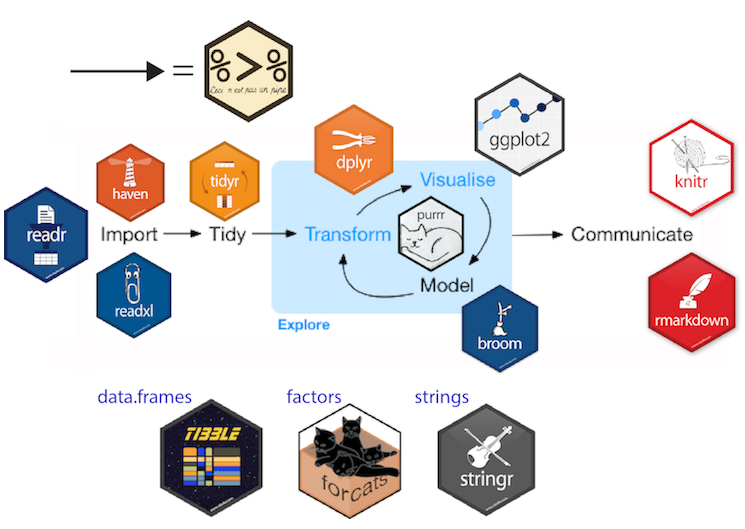
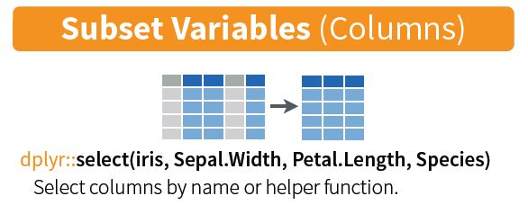
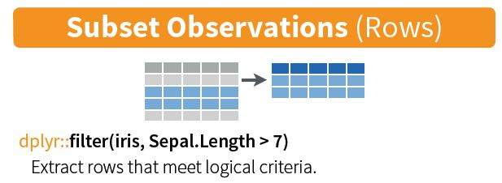
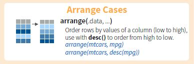
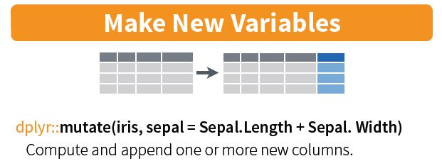
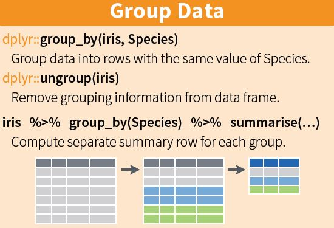
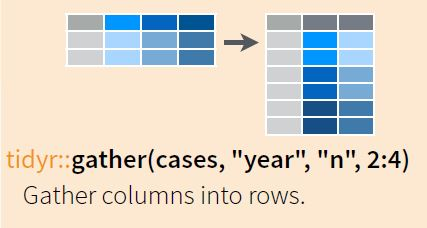
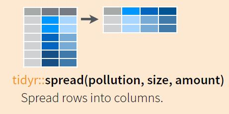

```{r setup, include = FALSE}
knitr::opts_chunk$set(comment = "#", warning = FALSE, message = FALSE)
library(fontawesome)
```

layout: true
  
<!-- <div class="my-footer"><span>arm.rbind.io/slides/xaringan</span></div> -->

<!-- this adds the link footer to all slides, depends on my-footer class in css-->

---

name: xaringan-title
class: left, middle
background-image: url(img/background.jpg)
background-size: cover

# Meet Tidyverse


### .fancy[Introduction to data wrangling with tidyverse]

.large[Winson Yang | Texas Tech University | `r Sys.Date()`]

<!-- this ends up being the title slide since seal = FALSE-->

---


# Acknowledgements

.pull-left[

.pull-left[


[TTU Department of Psychological Sciences](https://www.depts.ttu.edu/psy/)


]

.pull-right[


[Dr Robert Morgan, Department Chair](https://www.depts.ttu.edu/psy/people/rmorgan/index.php)

]

]

.pull-right[

.pull-left[


[Sean O'Bryan, Psychological Sciences Graduate Student Advisory Council]()

]

.pull-right[


[Tran Le, Psychological Sciences Graduate Student Advisory Council]()

]


]


---

class: inverse, center, middle

# Let's Get Started

---

class: right, middle


# Find me at...

[`r fa(name = "twitter")` @winsonfzyang](http://twitter.com/winsonfzyang)  
[`r fa(name = "github")` @winsonfzyang](http://github.com/winsonfzyang)  
[`r fa(name = "link")` winsonfzyang.github.io](https://winsonfzyang.rbind.io)  
[`r fa(name = "paper-plane")` winson.yang@ttu.edu](mailto:winson.yang@ttu.edu)

---

# Who am I 

--

Second year Experimental (Cognitive) Psychology student.

- Projects include Neurofeedback, Neuroscience of Meditaition, cognitive flexibility, Neurodegeneration

--

Other projects

- data visualization, UX/UI, software development for neuroscientists and psychologists  
- Programming education 

--

Interests

- Photography, baking, cooking, hiking

.pull-left[

.pull-left[

]

.pull-right[

]


]

.pull-right[

.pull-left[

]

.pull-right[

]


]


---

# Workshop aims

Introduce the main components of the Tidyverse
- readr (read files)
- dplyr, tidyr (manipulate data)
- ggplot2 (make awesome graphs)

I have to assume you have a basic knowledge of R

We don't really have time to cover all of the tidyverse (it is a huge universe!)


---

class: inverse, middle, center

# Day I: Data wrangling with tidyverse

---

background-image: url(img/messymeme.jpeg)
background-position: 50% 50%
background-size: cover
class: center, bottom, inverse

---

background-image: url(img/tidyversepackages.jpg)
background-position: 50% 50%
background-size: cover
class: center, bottom, inverse

---

# The tidyverse workflow!!



---

# Functions we will cover today

--

.pull-left[

- read_csv()
- skim()
- filter()
- select()

]


--

.pull-right[

- arrange()
- mutate()
- group_by() %>% summarize()

]

--

There are more functions in the tidyverse package, but this should be enough to get you going with data analysis!

If you have not done so already, please install all the packages in the tidyverse by running `install.packages("tidyverse")` in R Studio.

We will then load the package using `library(tidyverse)`.

---

# Importing data

--

With the `readr`, `haven`, `readxl` packages, we can load various type of data 

--

typical usage: `read_*()` where * can be csv, excel, spss

--

```{r message = FALSE}
library(tidyverse)

# Load data
df_csv <- read_csv("./../data/sample_data1.csv")
{{df_spss <- haven::read_spss("./../data/sample_data3.sav")}}
df_excel <- readxl::read_excel("./../data/sample_data3_datadictionary.xlsx")

```


--

*package*`::`*function* calls out a function from a package.

--


```{r message = FALSE}
df_spss <- haven::read_spss("./../data/sample_data3.sav")
```

is the same as:

--

```{r message = FALSE}
library(haven)

# Load data
df_spss <- read_spss("./../data/sample_data3.sav")
```


---

# Understanding your data


```{r eval = require('DT'), tidy = TRUE, echo = FALSE}
DT::datatable(
  df_csv,
  extensions = 'FixedColumns',
  options = list(
  dom = 't',
  scrollX = TRUE,
  scrollCollapse = TRUE,
  pageLength = 10)
)
```


---

# Selecting variables: **`select()`**

--

We use `select()` to select certain variables/columns  to work with (your data may be huge). 

--


.pull-left[

```{r message = FALSE}
df_csv %>% select(ID, Dx, Sex) %>% head()

```

]


--

.pull-right[



]


---

# Filtering variables: **`filter()`**

--

We use `filter()` to remove or select rows depending on their values.

--


.pull-left[

```{r message = FALSE}
df_csv %>% select(ID, Dx, Sex) %>% 
  filter(Dx == "CONTROL" & Sex == "Male")

```

]


--

.pull-right[



]

---

# Arranging variables: **`arrange()`**

--

We use `arrange()` to changes the order of our data.

--


.pull-left[

```{r message = FALSE}
df_csv %>% select(ID, Dx, Sex, MMSE) %>% 
  filter(Dx == "CONTROL") %>% 
  arrange(desc(MMSE))

```

]


--

.pull-right[



]


---

# Creating variables: **`mutate()`**

--

The job of `mutate()` is to add new columns that are functions of existing columns.

--


.pull-left[

```{r message = FALSE}
df_csv %>% filter(Dx == "CONTROL") %>% 
  select(ID, q1:q6) %>% 
  mutate(q_total = q1 + q2 + q3 + q4 + q5 + q6)

```

]


--

.pull-right[



]


---

# Renaming variables: **`rename()`**

--

The job of `rename()` is to add rename existing columns.

--


.pull-left[

```{r message = FALSE}
df_csv %>% filter(Dx == "CONTROL") %>% 
  select(ID, q1:q6) %>% 
  rename(WB_1 = q1, 
         WN_2 = q2)
```

]


--

.pull-right[


]


---

# Grouping variables and summarizing data: **`group_by()`** and **`summarize()`**

--

These two are usually a couple since we want to use them to create group summaries.

--


.pull-left[

```{r message = FALSE}
df_csv %>% group_by(Dx, Sex) %>% 
  summarize(Edu_mean = mean(Education),
            MMSE_mean = mean(MMSE)) %>%
  rename(Education = Edu_mean,
         MMSE = MMSE_mean)
```

]


--

.pull-right[



]


---

# Transforming between wide and long data: **`gather()`**

--

`Gather()` turns wide data into long format

--

.pull-left[

```{r message = FALSE}
df_csv %>% filter(Dx %in% c("AD", "bvFTD", "svPPA")) %>% 
  group_by(Dx) %>% 
  summarize(Edu_mean = mean(Education), 
            MMSE_mean = mean(MMSE))
```


]


--

.pull-right[

```{r message = FALSE}
df_csv %>% filter(Dx %in% c("AD", "bvFTD", "svPPA")) %>% 
  group_by(Dx) %>% 
  summarize(Edu_mean = mean(Education), 
            MMSE_mean = mean(MMSE)) %>%
  gather(key = "Cog", value = "Score", 
         Edu_mean, MMSE_mean)
```

]


---

# Transforming between wide and long data: **`spread()`**

--

`Spread()` turns long format into wide format

--

.pull-left[

```{r message = FALSE}
df_csv %>% filter(Dx %in% c("AD", "bvFTD", "svPPA")) %>% 
  group_by(Dx) %>% 
  summarize(Edu_mean = mean(Education), 
            MMSE_mean = mean(MMSE)) %>%
  gather(key = "Cog", value = "Score", 
         Edu_mean, MMSE_mean)
```


]


--

.pull-right[


```{r message = FALSE}
df_csv %>% filter(Dx %in% c("AD", "bvFTD", "svPPA")) %>% 
  group_by(Dx) %>% 
  summarize(Edu_mean = mean(Education), 
            MMSE_mean = mean(MMSE)) %>%
  gather(key = "Cog", value = "Score", 
         Edu_mean, MMSE_mean) %>%
  spread(key = "Cog", value = "Score")
```



]


---


class: center, middle

# Thanks! 

# Now let's get hands-on!

Slides created via the R package [**xaringan**](https://github.com/yihui/xaringan).
