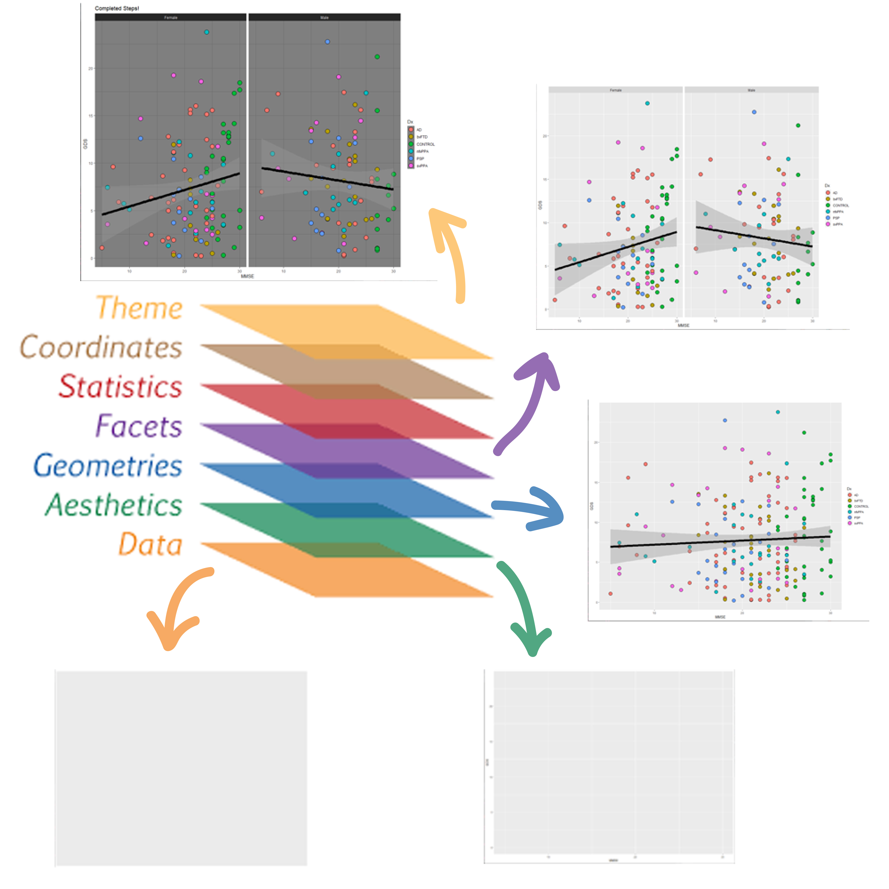

```{r setup, include = FALSE}
knitr::opts_chunk$set(comment = "#", warning = FALSE, message = FALSE)
library(fontawesome)
```

layout: true
  
<!-- <div class="my-footer"><span>arm.rbind.io/slides/xaringan</span></div> -->

<!-- this adds the link footer to all slides, depends on my-footer class in css-->

---

name: xaringan-title
class: left, middle
background-image: url(img/background.jpg)
background-size: cover

# Meet Tidyverse


### .fancy[Introduction to data visualization with ggplot]

.large[Winson Yang | Texas Tech University | `r Sys.Date()`]

<!-- this ends up being the title slide since seal = FALSE-->

---

class: right, middle


# Find me at...

[`r fa(name = "twitter")` @winsonfzyang](http://twitter.com/winsonfzyang)  
[`r fa(name = "github")` @winsonfzyang](http://github.com/winsonfzyang)  
[`r fa(name = "link")` winsonfzyang.github.io](https://winsonfzyang.rbind.io)  
[`r fa(name = "paper-plane")` winson.yang@ttu.edu](mailto:winson.yang@ttu.edu)

---

class: inverse, middle, center

# Day II: Data visualization with ggplot2

---

background-image: url(img/ggplot2_masterpiece.png)
background-position: 50% 50%
background-size: cover
class: center, bottom, inverse


---

# What is ggplot

GG: A Grammar of Graphics!

ggplot is a powerful graphics language for creating elegant and complex plots

---

# Why ggplot

* Automatic legends, colors, etc.

* Easy superposition, facetting, etc.

* Nice rendering (yet, I don't like the default grey theme).

* Store any ggplot2 object for modification or future recall. Super useful for packages.

* Lots of users (less bugs, much help on Stack Overflow).

* Lots of extensions.

* Nice saving option.

---

# Grammar of ggplot

<center>

</center>

---


# Setting the canvas: `ggplot()`

```{r message = FALSE, echo = FALSE}
library(tidyverse)

# Load data
df <- read_csv("./../data/sample_data2.csv")
```

.pull-left[

```{r plot-ggplot, eval=FALSE}

df %>% ggplot()

```
]

.pull-right[

```{r plot-ggplot-out, ref.label = "plot-ggplot", echo = FALSE}
```
]


---

# Setting the aesthetics: `aes()`

.pull-left[

```{r plot-aes, eval=FALSE}

df %>% ggplot(aes(x = `GDP per capita`,
                  y = `Healthy life expectancy`))

```
]

.pull-right[

```{r plot-aes-out, ref.label = "plot-aes", echo = FALSE}
```
]


---

# Adding geometric shapes: `geom_*()`

.pull-left[

```{r plot-geom1, eval=FALSE}

df %>% ggplot(aes(x = `GDP per capita`,
                  y = `Healthy life expectancy`)) +
  
  # Adding points to plot
  geom_point()

```
]

.pull-right[

```{r plot-geom1-out, ref.label = "plot-geom1", echo = FALSE}
```
]

---

# Stacking geometric shapes: `geom_*()`

.pull-left[

```{r plot-geom2, eval=FALSE}

df %>% ggplot(aes(x = `GDP per capita`,
                  y = `Healthy life expectancy`)) +
  
  # Adding points to plot
  geom_point() +
  
  # Adding line to plot
  geom_smooth(method = "lm")

```
]

.pull-right[

```{r plot-geom2-out, ref.label = "plot-geom2", echo = FALSE, out.width = "90%"}
```
]

---


# Splitting the graph: `facet_*()`


.pull-left[

```{r plot-facet, eval=FALSE}

df %>% ggplot(aes(x = `GDP per capita`,
                  y = `Healthy life expectancy`)) +
  
  # Adding points to plot
  geom_point() +
  
  # Adding line to plot
  geom_smooth(method = "lm") +
   
  # Splitting plot into Continents
  facet_wrap(. ~ Continent, nrow = 2, ncol = 3)

```
]

.pull-right[

```{r plot-facet-out, ref.label = "plot-facet", echo = FALSE}
```
]


---

# Adding more details and colors to the plot

.pull-left[

```{r plot-details, eval=FALSE}

df %>% ggplot(aes(x = `GDP per capita`,
                  y = `Healthy life expectancy`)) +
  
  # Adding points to plot
  geom_point(aes(color = Continent), size = 2) +
  
  # Adding line to plot
  geom_smooth(aes(color = Continent,
                  fill = Continent),
              method = "lm") +
  
  # Splitting plot into Continents
  facet_wrap(. ~ Continent, nrow = 2, ncol = 3)

```
]

.pull-right[

```{r plot-details-out, ref.label = "plot-details", echo = FALSE}
```
]


---

# Beautifying the graph: `theme()`


.pull-left[

```{r plot-theme, eval=FALSE}
# Add own color palette
mycolors <- c("#003F72", "#C4262E", "#3F9C35", 
              "#E37222", "#970254", "#E59FDB")

df %>% ggplot(aes(x = `GDP per capita`,
                  y = `Healthy life expectancy`)) +
  
  # Adding points to plot
  geom_point(aes(color = Continent), size = 2) +
  
  # Adding line to plot
  geom_smooth(aes(color = Continent,
                  fill = Continent),
              method = "lm") +
  
  # Splitting plot into Continents
  facet_wrap(. ~ Continent, nrow = 2, ncol = 3) +
  
  # Adding Manual Colors
  scale_fill_manual(values = mycolors) +
  scale_color_manual(values = mycolors) + 
  
  # Set themes
  theme_bw()

```
]

.pull-right[

```{r plot-theme-out, ref.label = "plot-theme", echo = FALSE}
```
]


---

# Adding in-line text: `geom_text()`

.pull-left[


```{r plot-extra, eval=FALSE}
# Add correlation
cor <- df %>% select(Continent, `GDP per capita`, `Healthy life expectancy`) %>%
  group_by(Continent) %>% 
  summarize(correlation = round(cor(`GDP per capita`, `Healthy life expectancy`), 2))

df %>% ggplot(aes(x = `GDP per capita`,
                  y = `Healthy life expectancy`)) +
  # Adding points to plot
  geom_point(aes(color = Continent), size = 2) +
  # Adding line to plot
  geom_smooth(aes(color = Continent,
                  fill = Continent),
              method = "lm") +
  # Splitting plot into Continents
  facet_wrap(. ~ Continent, nrow = 2, ncol = 3) +
 
  # Adding Manual Colors
  scale_fill_manual(values = mycolors) +
  scale_color_manual(values = mycolors) + 
  # Set themes
  theme_bw() +
  # Adding correlation text to plot
  geom_text(data = cor, 
            aes(x = 1.3, y = 0.05,
                label = paste("r = ", correlation, sep = "")), 
            size = 5)

```
]

.pull-right[

```{r plot-extra-out, ref.label = "plot-extra", echo = FALSE}
```
]


---


class: center, middle

# Thanks! 

# Now let's get hands-on!

Slides created via the R package [**xaringan**](https://github.com/yihui/xaringan).
